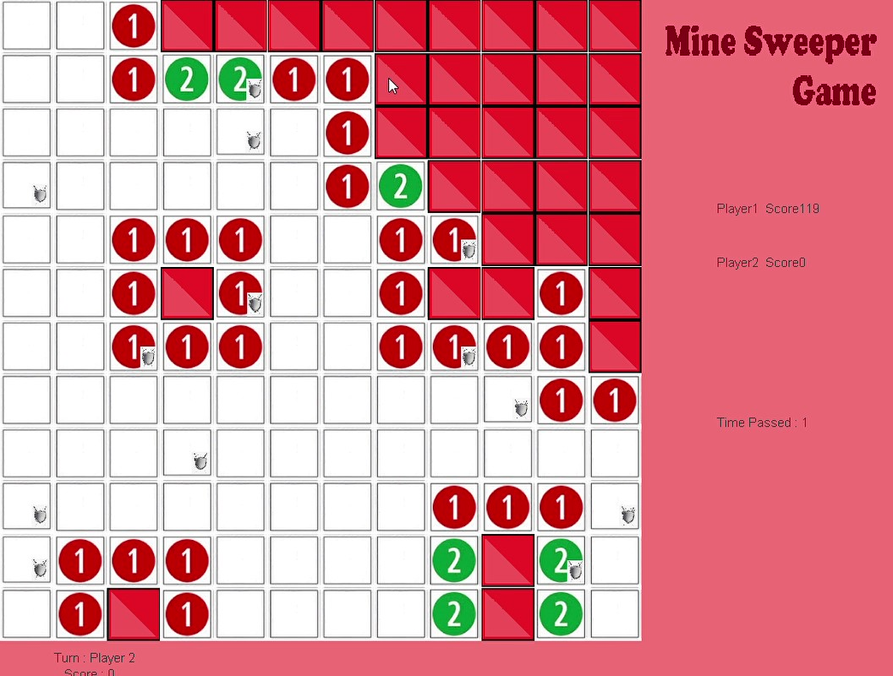
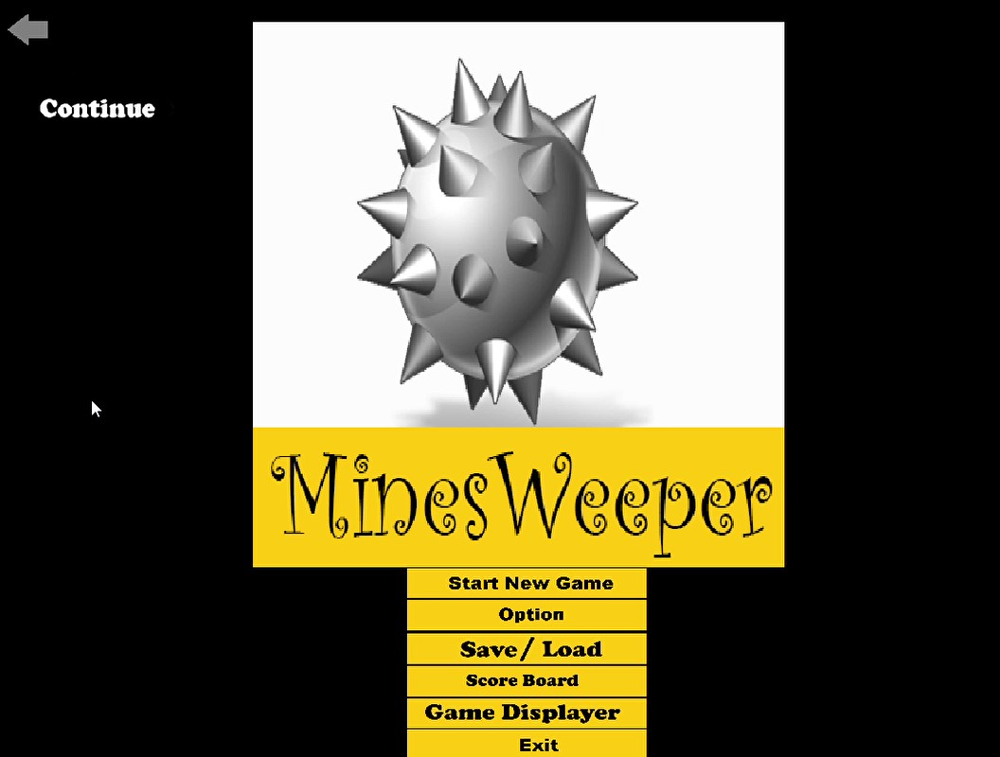
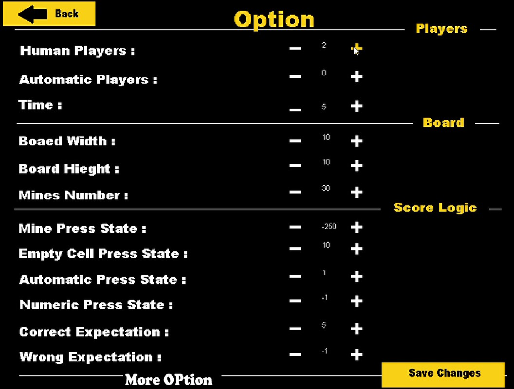
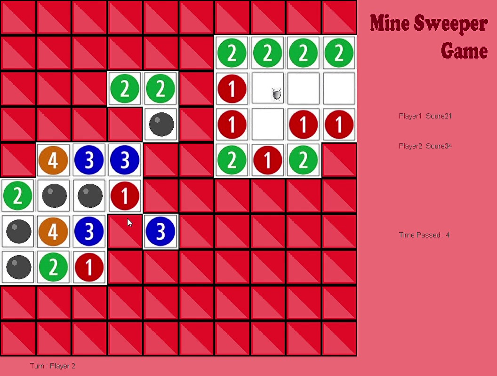
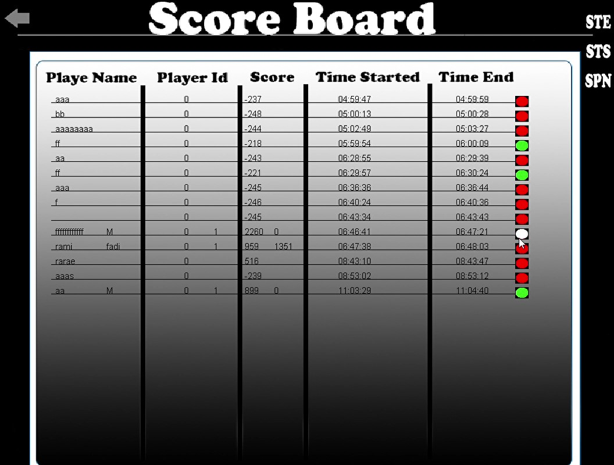

# Mines Weeper Game
This is an enhanced version of the classic Minesweeper game implemented in Java using Multithreaded and Object-Oriented Programming (OOP) principles.
new rules get added to the game like supporting multiplayer (human vs human, human vs computer), save and load game, display saved game, score record, shield concepts (something like health) and more.

### Note
Please be aware that this codebase is one of my earliest projects, developed in early 2017 when I was just starting my career. As such, it may not reflect my current coding standards or best practices. While it serves as a testament to my learning journey, I recommend reviewing the code with this context in mind.

## Features
- **Multithreading Programming for UI and Computation Separation**: Carefully managed interactions between threads to ensure smooth gameplay and user experience.
- **Object-Oriented Programming (OOP)**: Employed Object-Oriented Programming principles to design a modular and scalable codebase.
- **Mine Sweeper Game with Advanced Roles**: Developed a Mine Sweeper game with additional roles, offering enhanced gameplay experiences beyond the traditional rules.
- **File Storage for Game Persistence and Statistics**: Leveraged Java I/O stream SDK for efficient reading and writing of game data, enabling players to resume saved games and track their progress over time.
- **Desktop Application in Java**: Built a desktop application using Java, leveraging its robustness and cross-platform compatibility. Utilized Java's rich ecosystem and libraries to develop a feature-rich Mine Sweeper game.
- **Flexible User Interface (UI) for Parameter Customization**: Empowered players to adjust settings such as the number of shields for each player, board dimensions, and timeout settings to tailor the game to their preferences.

## Demo
[DEMO](https://drive.google.com/drive/folders/1Ku5xlSo3HvlcCpj6LKSet5IKCy6-SazJ?usp=drive_link)

## Screenshots

